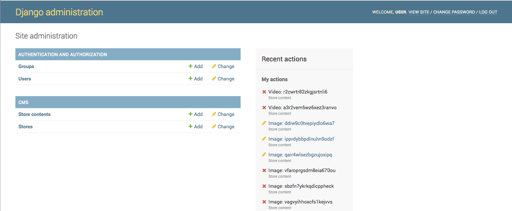
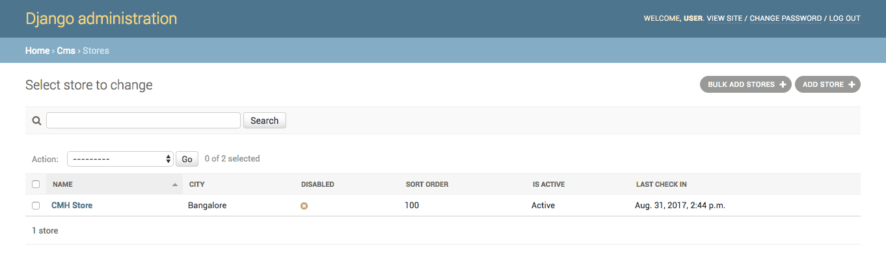
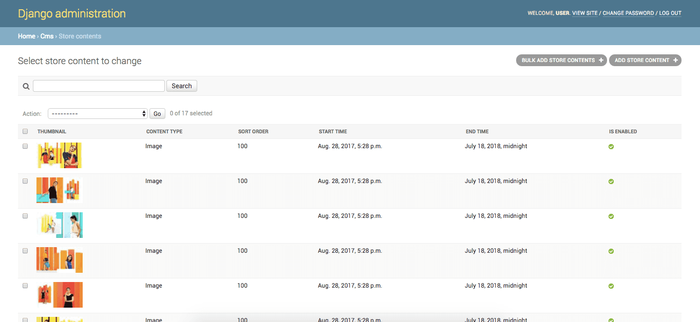

# Store CMS



A simple dashboard to for managing content across your stores.

 This is a simple django project which you can download and try.


## Installation
(This section assumes you have basic Python-Django knowledge)

### Cloudinary
- Create a Cloudinary account [here](http://cloudinary.com/).
How to use it in the project will be explained later.

### Project setup
- Download the project directory
- Install dependencies
(This section assumes you have pip installed in your system and virtualenv activated.)
Run the command ```pip install -r requirements/local.txt``` to install the dependencies. Use ```requirements/production.txt``` when you're installing dependencies on production. After this is done, you'll have Django and other dependencies installed in your virtualenv.
- Set environment
Create a file `.env` in your settings directory. Copy the contents from `.env.template` to `.env` file. This is where you put the Cloudinary credentials. Fill in all the details.
- Run migrations
To run the migrations, type ```python manage.py migrate``` and press enter.
- Run your project
Run ```python manage.py runserver``` in your terminal and you have the project up and running.


## Features

This contains two sections. Admin and Django APIs.

### Django Admin Dashboard

Django's default dashboard is used here. This section of the app can be used by content managers to create stores and contents. This includes Django's basic functionalities like creating user, changing password etc.

#### Dashboard main page

This page will list all the apps used in the project and the recent actions done by the admin user



#### Stores

Here you will be able to see all the stores created and their details. You can also create another store by clicking on add store button. While creating a new store, a new user also should be created and assigned to the store in django. The password used here has to be used to login in the store TV application.



Against each store, you can see whether the store is disabled or if the store is actively checking for new contents.

#### Store contents

In this page, you can see all the contents uploaded. You can add contents. Content can be either video or image. The contents uploaded by content manager will be directly uploaded to Cloudinary.




### Django APIs


- **List stores API:** This API will return all the enabled stores in a json response.
- **Login API:** After the store manager selects the store and enters their password, this api is called to login the store.
- **List contents API:** This API will return all the contents corresponding to the logged in store. Disabled and expired contents are excluded in this API.